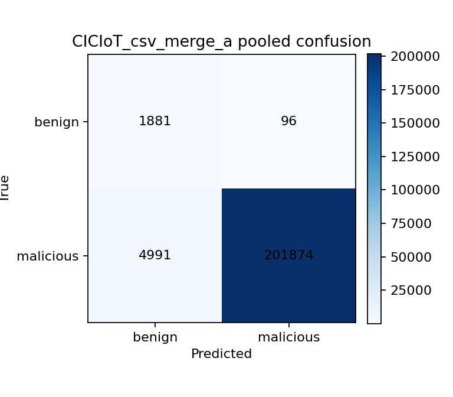
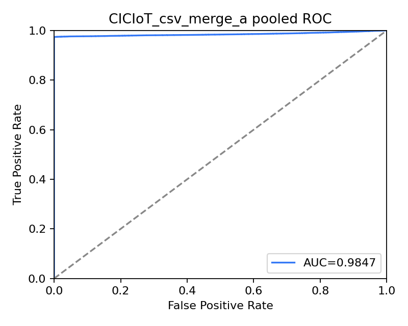
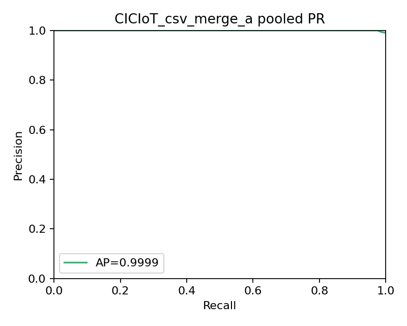

# 最终实验报告

## 1. 实验目标
本项目当前阶段的核心目标，是在不引入 `nuisance-aware` 扩展分支的前提下，基于真实、稳定、可追溯的结果，给出一份收口版最终实验报告。根据仓库内现有结果文件，最终正式纳入报告的实验结果只包含两部分：其一为 `CICIoT2023` 的 `merge01.csv` 主实验结果；其二为 `CTU13` 场景 `48/49/52` 的图侧主 benchmark 结果。
之所以最终只采用这两部分结果，是因为它们同时满足以下条件：第一，存在真实结果文件、指标表、日志和图表；第二，能够形成一条相对稳定的结论链；第三，不需要依赖当前尚未完成的跨数据集完整 PCAP 主实验矩阵。基于这些约束，本报告不再扩展到新的数据集或新的重实验，也不把尚未系统完成的多数据集 PCAP 路线写入正式结论。
本报告中 `use_nuisance_aware=false` 是明确前提。关闭 nuisance-aware 并不妨碍当前主结论成立，因为本阶段要回答的核心问题并不是复杂背景流量抑制是否已经完全解决，而是：现有主模型能否在一条标准表格输入线上给出稳定的二分类结果，以及能否在一条基于原始 PCAP 构建流图后的图实验线上给出可复核的 benchmark 结果。
因此，本报告要回答的核心问题有两个。第一，`merge01.csv` 是否足以作为当前 CSV 主结果，用来证明分类器在标准流特征表格输入上的分类能力。第二，`CTU13 48/49/52` 是否可以作为图侧主 benchmark，并被准确表述为 `PCAP-based graph benchmark` 或“基于原始 PCAP 构建流图后的 benchmark”，同时不夸大为完整跨数据集 PCAP 主实验体系已经完成。

## 2. 实验设计
当前正式纳入的实验设计由两条线构成。第一条是 CSV 主实验线，角色是验证分类器在标准化、表格化流特征输入上的能力；第二条是图实验线，角色是验证从原始 PCAP 出发，经由 flow 构建、graph 构建、feature 提取，再到 scorer 或 classifier 的整条下游链路是否可行。
`merge01.csv` 被选为 CSV 主结果，是因为 `outputs/summary/all_metrics.json` 中存在完整的三随机种子运行记录，且其对应日志、指标文件和图表都可直接对齐到 `artifacts/cic_iot2023/Merged01.csv`。这意味着该结果具有较高的可审计性和稳定性，可以作为当前阶段最可靠的 CSV 正式结果。
`CTU13 48/49/52` 被选为图侧 benchmark，是因为 `results/ctu13_binary_benchmark.*` 与 `results/ctu13_edge_centric_comparison.*` 明确给出了以场景 `48/49/52` 为主的 scenario-wise 与 merged benchmark 结果；同时 `results/ctu13_flow_label_alignment_summary.*` 与 `results/ctu13_primary_graph_extraction_summary.*` 提供了从原始场景数据进入图建模链路的旁证。因此，这部分结果可以被准确写成 `PCAP-based graph benchmark` 或 `PCAP-derived graph benchmark`。
本报告中的 nuisance-aware 状态固定为关闭，即 `use_nuisance_aware=false`。虽然结果目录中保留了 nuisance-aware 相关的历史比较行，但它们不属于本报告最终正式采纳的结果集合。正式结论只围绕当前 single-stage 主线与其非 nuisance-aware 版本展开。
在任务定义上，对外仍然采用二分类表述，即 benign/normal 为 `0`，malicious/attack/botnet 为 `1`。但对 CTU13 而言，依据 `results/ctu13_binary_benchmark.md` 可确认：primary metrics 只对 benign 与 malicious 计算，background/unknown 只作为 secondary analysis 报告。这说明正式任务定义仍是二分类，只是图 benchmark 同时保留了对复杂背景流量的附加诊断。

## 3. 数据集说明
### 3.1 CICIoT2023 / merge01.csv
`merge01.csv` 对应的真实输入路径为 `/home/xdo/traffic_classicial/artifacts/cic_iot2023/Merged01.csv`，其结果由 `outputs/summary/all_metrics.json` 中的 `CICIoT_csv_merge_a` 条目直接对应。依据 `outputs/metrics/CICIoT_csv_merge_a_seed42-20260417T120010Z.json`，该实验的数据形式是带显式 `Label` 列的表格化流特征输入，并包含固定的一组数值特征列，如 `Header_Length`、`Protocol Type`、`Time_To_Live`、`Rate` 以及若干 TCP flag、计数统计与时序统计特征。
在本项目中，`merge01.csv` 的作用是提供一条标准化、低工程噪声的主结果线，用于证明分类器在已清洗、已结构化的流特征表格输入上能够实现高质量的二分类。它之所以适合承担这一角色，是因为其结果文件同时保留了输入路径、标签映射、清洗记录、训练/验证/测试划分、随机种子以及最终评估指标，可以较清楚地把“分类器能力”与“上游 PCAP 解析复杂性”区分开来。

### 3.2 CTU13 场景 48 / 49 / 52
`CTU13` 场景 `48/49/52` 的正式结果来自 `results/ctu13_binary_benchmark.*` 和 `results/ctu13_edge_centric_comparison.*`。依据这些文件以及 `results/ctu13_flow_label_alignment_summary.*`、`results/ctu13_primary_graph_extraction_summary.*`，这部分结果的来源可以描述为：从原始 CTU13 场景数据出发，经过 flow label alignment、graph extraction、feature packing 和 graph-level scoring 后形成的 benchmark 结果。
因此，这部分结果必须准确写成 `PCAP-based graph benchmark`，或者写成“基于原始 PCAP 构建流图后的 benchmark”。其逻辑链路应表述为：`PCAP -> flow -> graph -> feature -> scorer/classifier`。其中，`results/ctu13_flow_label_alignment_summary.md` 给出了 flow-level 对齐摘要，而 `results/ctu13_primary_graph_extraction_summary.md` 给出了进入 graph-level benchmark 前的候选图统计。
需要特别强调的是：尽管这部分结果来自原始 PCAP 的下游图建模链路，但它不等于“完整多数据集 PCAP 主实验体系已经完成”。本报告不把它扩展解释为多数据集、跨数据集的完整 PCAP 实验矩阵，也不据此声称 `CICIDS2017 PCAP` 已经系统验证完成。

## 4. 实验流程
### 4.1 CSV 实验流程
依据 `outputs/logs/CICIoT_csv_merge_a_seed42-20260417T120010Z.log` 和对应 metrics 文件可确认，CSV 实验流程包括：读取 `Merged01.csv`；执行 NaN/Inf 清洗；按显式标签映射将 benign 类映射为 `0`、攻击类映射为 `1`；再执行 train/validation/test 划分并训练现有二分类检测主线。日志明确记录了清洗后的样本量、替换的 NaN/Inf 数量，以及 train/val/test 的样本规模和类别分布。
从现有日志可确认到的范围看，该实验并未启用 nuisance-aware，且训练阶段只使用 benign 样本。日志中记录的 `Training epochs=0` 表明该 CSV 主线采用的是现有稳定表格二分类路径，其“训练轮数”并不等价于图模型的多 epoch 训练；而 metrics 配置文件中保留了统一配置面的 `epochs=2`、`batch_size=2`、`learning_rate=1e-3` 等字段。
评估阶段基于真实导出的 `overall_scores.csv` 重新汇总 Accuracy、Precision、Recall、F1、Macro-F1、Balanced Accuracy、ROC-AUC 与 PR-AUC，并从同一批 score 文件生成 confusion matrix、ROC curve 和 PR curve。因此，CSV 结果既有数值表，也有对应图表。

### 4.2 CTU13 图实验流程
对于 CTU13 图侧 benchmark，依据 `results/ctu13_flow_label_alignment_summary.md`、`results/ctu13_primary_graph_extraction_summary.md`、`results/ctu13_binary_benchmark.md` 与 `results/ctu13_edge_centric_comparison.md` 可以确认，其流程至少包括以下环节：首先从原始场景数据中构建 flow-level 对齐结果；然后在固定窗口和固定 grouping policy 下构建候选图；再对图进行 feature 提取与 graph-level scoring；最后输出 scenario-wise 与 merged benchmark 指标。
现有结果文件能够明确证明这是一条从原始 PCAP 下游派生出来的图 benchmark 链路，但无法像 CSV 日志那样逐条恢复每一步的完整运行日志。因此，本报告对 CTU13 图实验流程的描述限于“依据现有日志/配置/结果文件可确认到的范围”。在该范围内，可以确认它是 graph benchmark，而不能确认它已经扩展成一套完整的跨数据集 PCAP 主实验体系。

## 5. 实验环境
- 操作系统：`Linux-6.8.0-90-generic-x86_64-with-glibc2.39`
- Python 版本：`3.12.13 | packaged by conda-forge | (main, Mar  5 2026, 16:50:00) [GCC 14.3.0]`
- NumPy：`2.4.2`
- pandas：`3.0.1`
- scikit-learn：`1.8.0`
- matplotlib：`3.10.8`
- PyTorch：`2.11.0+cpu`
- CUDA / GPU：`CPU only / CUDA unavailable`
- nuisance-aware：关闭，即 `use_nuisance_aware=false`。
- 随机种子：CSV 主结果明确使用 `42`、`43`、`44`；CTU13 图 benchmark 的结果文件是 scenario-wise 与 merged benchmark 汇总表，未在最终比较表中逐条展开随机种子维度。
- 可确认的 CSV 主结果配置：`threshold_percentile=95.0`、`random_seed in {42,43,44}`、`batch_size=2`、`epochs=2`、`learning_rate=1e-3`、`weight_decay=0.0`、`window_size=60`。这些字段来自 `outputs/metrics/CICIoT_csv_merge_a_seed42-20260417T120010Z.json`。
- 可确认的 CTU13 图 benchmark 配置：`graph_score_reduction`、`support_summary_mode`、`evaluation_mode`、`scenario_id`、`background_hit_ratio` 等信息存在于 `results/ctu13_binary_benchmark.*` 与 `results/ctu13_edge_centric_comparison.*`。但这些最终结果表并未完整保存底层依赖版本、batch size、epoch 等全部训练环境细节，因此本报告不对这些缺失项作任何编造。

## 6. 实验结果
### 6.1 merge01.csv 的实验结果
正式纳入的 CSV 主结果是 `CICIoT_csv_merge_a`，对应输入文件 `Merged01.csv`。其三随机种子汇总结果如下：

| 指标 | 结果 |
| --- | --- |
| Accuracy | 0.9756 ± 0.0004 |
| Precision | 0.9995 ± 0.0000 |
| Recall | 0.9759 ± 0.0004 |
| F1 | 0.9876 ± 0.0002 |
| Macro-F1 | 0.7064 ± 0.0029 |
| Balanced Accuracy | 0.9637 ± 0.0024 |
| ROC-AUC | 0.9847 ± 0.0006 |
| PR-AUC | 0.9999 ± 0.0000 |

对应的单种子结果如下：

| 随机种子 | Accuracy | Precision | Recall | F1 | ROC-AUC | PR-AUC |
| --- | ---: | ---: | ---: | ---: | ---: | ---: |
| 42 | 0.9755 | 0.9995 | 0.9758 | 0.9875 | 0.9850 | 0.9999 |
| 43 | 0.9762 | 0.9996 | 0.9764 | 0.9879 | 0.9853 | 0.9999 |
| 44 | 0.9752 | 0.9995 | 0.9754 | 0.9873 | 0.9839 | 0.9998 |

CSV 主结果对应的真实图表路径如下：
- confusion matrix：报告内嵌副本 `reports/assets/CICIoT_csv_merge_a_confusion.png`；原始来源 `/home/xdo/traffic_classicial/outputs/figures/CICIoT_csv_merge_a_confusion.png`
- ROC curve：报告内嵌副本 `reports/assets/CICIoT_csv_merge_a_roc.png`；原始来源 `/home/xdo/traffic_classicial/outputs/figures/CICIoT_csv_merge_a_roc.png`
- PR curve：报告内嵌副本 `reports/assets/CICIoT_csv_merge_a_pr.png`；原始来源 `/home/xdo/traffic_classicial/outputs/figures/CICIoT_csv_merge_a_pr.png`

### 6.2 CTU13 48/49/52 的图侧 benchmark 结果
正式纳入的图侧结果来自 `results/ctu13_edge_centric_comparison.csv` 中的 scenario-wise 与 merged 条目。根据用户要求，本报告只采用非 nuisance-aware 的图侧主 benchmark，即表中的 `edge_v2` 列，不把 nuisance-aware 结果纳入最终正式结论。

| 场景 | baseline F1 | graph benchmark F1 | baseline Recall | graph benchmark Recall | baseline FPR | graph benchmark FPR | baseline background hit ratio | graph benchmark background hit ratio | 使用的 graph benchmark profile |
| --- | ---: | ---: | ---: | ---: | ---: | ---: | ---: | ---: | --- |
| scenario 48 | 0.0000 | 0.6667 | 0.0000 | 0.5000 | 0.0000 | 0.0000 | 0.0892 | 0.1561 | heldout_q99_top5 + local_support_density |
| scenario 49 | 0.0000 | 0.8571 | 0.0000 | 1.0000 | 0.0909 | 0.0909 | 0.0793 | 0.3286 | heldout_q95_top1 + local_support_density |
| scenario 52 | 0.4000 | 1.0000 | 0.2500 | 1.0000 | 0.0000 | 0.0000 | 0.1183 | 0.2546 | heldout_q99_top5 + local_support_density |
| merged 48/49/52 | 0.2857 | 0.9412 | 0.1765 | 0.9412 | 0.0294 | 0.0294 | 0.0704 | 0.2844 | heldout_q95_top1 + local_support_density |

作为图侧 benchmark 的支持性结果文件如下：
- `results/ctu13_edge_centric_comparison.md`：`../results/ctu13_edge_centric_comparison.md`
- `results/ctu13_binary_benchmark.md`：`../results/ctu13_binary_benchmark.md`
- `results/ctu13_flow_label_alignment_summary.md`：`../results/ctu13_flow_label_alignment_summary.md`
- `results/ctu13_primary_graph_extraction_summary.md`：`../results/ctu13_primary_graph_extraction_summary.md`

其中，flow-level 对齐摘要为：

# CTU-13 Flow Label Alignment Summary

| scenario_id | total_flows | benign | malicious | unknown | unaligned | alignment_rate |
| --- | ---: | ---: | ---: | ---: | ---: | ---: |
| 48 | 14074 | 119 | 3 | 13952 | 26 | 0.9982 |
| 49 | 16140 | 244 | 4 | 15892 | 22 | 0.9986 |
| 52 | 26811 | 94 | 14 | 26703 | 101 | 0.9962 |

进入 primary graph extraction 前的图统计为：

# CTU-13 Primary Graph Extraction Summary

| scenario_id | window_size | graph_grouping_policy | candidate_graph_count | benign_graph_count | malicious_graph_count | unknown_heavy_graph_count | filtered_out_reason |
| --- | ---: | --- | ---: | ---: | ---: | ---: | --- |
| 48 | 5 | per_src_ip_within_window | 4199 | 26 | 2 | 4171 | none |
| 49 | 5 | per_src_ip_within_window | 5431 | 33 | 3 | 5395 | none |
| 52 | 2 | per_src_ip_within_window | 12639 | 50 | 12 | 12577 | none |

在当前正式采纳的结果集合中，没有发现与 CTU13 48/49/52 graph benchmark 一一对应的独立 PNG 曲线图文件；因此本报告对 CTU13 部分只引用真实存在的 benchmark 表和摘要文件，不补造任何额外图表。

## 7. 结果分析
`merge01.csv` 的结果主要证明的是：在标准化、表格化的流特征输入上，当前分类器具备很强的二分类能力。其 F1、ROC-AUC 与 PR-AUC 都处于较高水平，且三随机种子的波动很小。这说明，只要输入已经被规整为稳定的流特征表，现有模型在 benign 与 malicious 的区分上是可靠的。
`CTU13 48/49/52` 的结果主要证明的是：从原始 PCAP 出发，经由 flow 构建、graph 构建、feature 提取，再到 graph-level scorer/classifier 的链路是可行的，而且在主 benchmark 上能够取得明显优于 node-centric baseline 的结果。依据 `results/ctu13_edge_centric_comparison.csv`，merged 48/49/52 上图主线的 F1 达到 `0.9412`，Recall 达到 `0.9412`，在 primary 指标上明显优于 baseline。
之所以可以把 CTU13 结果称为 `PCAP-based graph benchmark`，是因为这套结果并不是直接从表格 CSV 得到的，而是来自原始 PCAP 下游的图建模链路。`ctu13_flow_label_alignment_summary` 和 `ctu13_primary_graph_extraction_summary` 说明了 flow 对齐和 graph extraction 过程的存在，`ctu13_binary_benchmark` 与 `ctu13_edge_centric_comparison` 则给出了最终的 graph-level evaluation。换言之，这是一套以原始 PCAP 为源头的 graph benchmark。
但这部分结果不能直接写成“完整 PCAP 主实验体系已经完成”。原因在于：第一，本报告没有纳入 `CICIDS2017 PCAP` 等其他目标数据集的系统结果；第二，当前正式结论只覆盖 CTU13 这一个图 benchmark 数据来源；第三，CTU13 的这套结果虽然是 PCAP-based graph benchmark，但并不等于已经形成了一套跨数据集、跨模态、可全面横向对比的完整 PCAP 主实验矩阵。
在 nuisance-aware 关闭的情况下，当前主结论仍然成立。对 CSV 主结果而言，`use_nuisance_aware=false` 并未妨碍模型在 `merge01.csv` 上取得稳定高分；对 CTU13 图 benchmark 而言，正式纳入的 `edge_temporal_binary_v2` 非 nuisance-aware 结果已经足以构成图侧主 benchmark。因此，nuisance-aware 在当前最终报告中不是必要项。

## 8. 局限性
当前正式结果只覆盖 `merge01.csv` 与 `CTU13 48/49/52`。这意味着，本报告的结论范围是受限的：它能够支持“标准表格二分类主结果已经成立”和“存在一套 PCAP-based graph benchmark 主结果”，但不能支持“完整多数据集 PCAP 主实验矩阵已经建立”。
本报告没有纳入 `CICIDS2017 PCAP` 的系统结果，也没有纳入一套完整跨数据集的 packet-side 对照结果。因此，不能声称已经完成了完整跨数据集 PCAP 对照验证，更不能把 CTU13 这套 graph benchmark 推广为“多数据集完整 PCAP 体系已经全部验证完成”。
此外，仓库中虽然存在更多历史结果文件、补充实验产物以及 nuisance-aware 相关比较行，但它们并不都满足“稳定、正式、当前最终采纳”的标准。因此，这些重路线或补充实验没有被纳入最终正式结论，其存在只能作为历史痕迹，而不能扩大本报告的结论边界。

## 9. 结论
第一，`merge01.csv` 足以支撑当前阶段的 CSV 主结论。基于真实的三随机种子运行结果，可以明确得出：现有模型在标准流特征表格输入上具有较强且稳定的二分类能力。
第二，`CTU13 48/49/52` 可以作为图侧主 benchmark，而且应当被准确写成 `PCAP-based graph benchmark` 或“基于原始 PCAP 构建流图后的 benchmark”。这部分结果能够证明原始 PCAP 下游图建模链路是可行的，并且在主 benchmark 上取得了有竞争力的结果。
第三，nuisance-aware 在当前最终结果里不是必要项。本报告的正式结果全部建立在 `use_nuisance_aware=false` 的前提上，且仍然可以形成清晰、可提交的主结论。
第四，当前并没有完成完整 PCAP 主实验体系。更准确的表述应当是：本项目**已有 CTU13 的 PCAP-based graph benchmark 结果**，但**尚未形成完整的跨数据集 PCAP 主实验矩阵**。

## 10. 可复现性说明
本报告优先引用以下目录中的真实结果文件：`outputs/summary/*`、`outputs/metrics/*`、`outputs/figures/*`、`outputs/logs/*`、`results/*` 和 `reports/*`。其中，CSV 主结果的核心索引文件是 `outputs/summary/all_metrics.json`，原始图表来源于 `outputs/figures/CICIoT_csv_merge_a_*`，对应日志来自 `outputs/logs/CICIoT_csv_merge_a_seed*.log`，配置与输入摘要来自 `outputs/metrics/CICIoT_csv_merge_a_seed*.json`。为保证 GitHub 克隆后的报告渲染稳定，本报告实际引用的是从上述原始图表复制到 `reports/assets/` 下的只读副本。
CTU13 图 benchmark 的核心索引文件是 `results/ctu13_edge_centric_comparison.csv` 与 `results/ctu13_binary_benchmark.csv`，其说明性文件是 `results/ctu13_edge_centric_comparison.md`、`results/ctu13_binary_benchmark.md`、`results/ctu13_flow_label_alignment_summary.md` 和 `results/ctu13_primary_graph_extraction_summary.md`。如果后续需要复查 CTU13 结果，应优先检查这些文件。
如果需要复核 CSV 主结果，应优先检查：`outputs/summary/all_metrics.json` 中的 `CICIoT_csv_merge_a` 条目、对应的 `outputs/metrics/CICIoT_csv_merge_a_seed*.json`、`outputs/logs/CICIoT_csv_merge_a_seed*.log` 以及三张图表文件。若需要复核 CTU13 图 benchmark，应优先检查 `results/ctu13_edge_centric_comparison.csv` 与 `results/ctu13_binary_benchmark.csv`，再结合对齐与图提取摘要文件理解其来源。
仓库中存在历史命名不完全统一的结果文件，例如 `CICIoT_csv_merge_a` 实际对应 `Merged01.csv`，CTU13 的不同研究分支也共存于 `results/` 目录下。因此，本报告对文件的采用遵循“只采纳与最终口径直接对应的真实文件”这一原则，而不对命名历史做无依据猜测。
