# 项目总文档母稿

## 1. 项目概述

### 1.1 项目名称
基于流特征与交互图表示的恶意流量检测研究

### 1.2 一句话摘要
本项目面向恶意流量检测问题，采用 **benign-only normality modeling** 与 **unsupervised anomaly detection** 作为理论核心，在“标准化流特征表格输入”和“原始 PCAP 下游图建模输入”两条互补证据链上，分别验证模型的分类能力与图侧检测链路的可行性。

### 1.3 研究对象
本项目研究对象是网络环境中的恶意流量（malicious traffic）。对外任务形式可以表述为二分类问题：将 benign / normal 映射为 `0`，将 malicious / attack / botnet 映射为 `1`。但是，本项目的内部方法论并不建立在传统监督式“benign 与 malicious 联合训练分类器”的框架上，而是以 benign-only 的正常行为建模为主，借助异常分数来识别偏离正常模式的样本。

### 1.4 方法论定位
本项目的方法论定位可以概括为：**以 benign-only 异常检测为理论核心，以流特征表格表示与流交互图表示为两条互补观测视角的恶意流量检测研究**。其中，CSV line 主要回答“模型是否具备分类能力”，Graph line 主要回答“从原始 PCAP 到检测的链路是否可行，以及图表示是否具有结构价值”。

### 1.5 当前正式口径
本项目当前正式结论只基于两条真实证据链：

1. `CICIoT2023` 的 `merge01.csv` 主实验；
2. `CTU13` 场景 `48 / 49 / 52` 的图侧主 benchmark。

当前正式前提固定为：

- `use_nuisance_aware = false`

因此，本项目当前可以正式宣称的是：

- `merge01.csv` 足以支撑当前 CSV 主结论；
- `CTU13 48/49/52` 可以作为图侧主 benchmark；
- 当前已经形成了 `CTU13` 的 **PCAP-based graph benchmark** 结果；
- 当前项目证明了分类能力与图侧链路可行性。

但不能宣称的是：

- 完整多数据集 PCAP 主实验体系已经完成；
- 已建立跨数据集完整 PCAP 实验矩阵；
- `CICIDS2017 PCAP` 已系统验证完成；
- background / unknown 问题已经解决；
- nuisance-aware 是当前最终主线；
- episode-graph 已成为最终系统核心。

## 2. 研究背景与问题提出

### 2.1 加密流量检测为什么重要
随着网络应用不断向加密通信迁移，传统依赖明文载荷内容的检测手段面临日益明显的适用性下降问题。对于现代网络环境而言，流量内容越来越难以直接获取，即使能够读取部分协议字段，也常常不足以支撑对复杂攻击行为的稳定识别。因此，恶意流量检测正逐步从“基于载荷内容的特征匹配”转向“基于行为统计、交互结构与时序模式的异常检测”。

恶意流量检测之所以重要，不仅因为它是网络安全防御的核心问题之一，更因为它直接决定了在加密、弱监督、标签稀缺和背景流量复杂的现实环境中，检测系统是否仍然能够保持有效。换言之，恶意流量检测研究所面对的不是一个理想化的图像分类问题，而是一个强噪声、强不平衡、强场景依赖的行为识别问题。

### 2.2 为什么传统基于载荷的方法受限
传统基于明文载荷的规则方法、签名匹配方法或深度载荷分析方法，在流量可见性较高的时代具有较好表现，但在当前环境下存在明显局限：

1. 加密流量使得载荷内容难以直接访问；
2. 新型攻击与变种攻击可能规避显式规则；
3. 实际系统中往往缺乏高质量、细粒度、长期更新的监督标签。

这意味着，仅依赖明文载荷内容或强监督标签的检测框架，难以在真实复杂网络环境中长期稳定工作。

### 2.3 为什么纯监督分类不足以覆盖真实复杂场景
纯监督分类的核心前提是：训练集中的 benign 与 malicious 标签既完整、又足够覆盖未来测试分布。然而恶意流量检测的现实环境通常不满足这一点。特别是 background / unknown 流量的大量存在，会让“非 benign”的样本分布远比一个干净的恶意类别更复杂。研究过程中已经反复暴露出这一事实：未知背景流量可能在统计上偏离 benign，但又不等于明确 malicious，从而使得纯二分类的监督边界变得脆弱。

### 2.4 为什么 benign-only 异常检测是合理路线
在上述背景下，采用 **benign-only normality modeling** 作为理论核心，是一条具有现实合理性的研究路线。其基本思想是：仅利用 benign 数据刻画正常行为参考，再通过偏离程度评估待测样本是否异常。这样做有三方面理论优势：

1. 不要求在训练阶段获得完备 malicious 标签；
2. 更符合真实环境中“已知正常远多于已知恶意”的数据条件；
3. 能够将检测问题转化为“偏离正常模式的程度估计”，而不是“是否属于有限恶意类别”的封闭分类问题。

因此，本项目不是简单意义上的“监督二分类器”，而是一个 **以 benign-only 异常检测为核心、对外表现为二分类输出的恶意流量检测系统**。

## 3. 研究目标与核心问题

### 3.1 核心研究问题
本项目的核心研究问题可以概括为：

> 在不依赖 malicious 监督训练的前提下，能否用 benign 数据建立正常行为参考分布，并通过流特征或图结构表示实现对恶意流量的有效检测？

进一步细化后，项目当前正式阶段主要回答两个问题：

1. 在标准流特征表格输入上，模型是否已经具备稳定且较强的分类能力？
2. 在原始 PCAP 下游图建模链路上，系统是否已经证明 `PCAP -> flow -> graph -> feature -> detection` 的路径是可行的？

### 3.2 双视角验证思路
为回答上述两个问题，项目采用了双视角验证思路：

- **CSV line**：尽量降低上游工程复杂度，专注回答“模型在规整输入上的判别能力是否成立”。
- **Graph line**：从原始 PCAP 出发，经由流构建、图建模和图级判定，回答“完整图链路是否可行，以及图表示是否带来结构价值”。

这种设计并不是为了重复做两遍相同实验，而是为了把“模型本身的能力”与“工程链路的可行性”分开验证。

### 3.3 为什么采用 CSV line 与 graph line
CSV line 与 Graph line 的作用分工非常明确：

1. `merge01.csv` 更接近模型判别能力的验证窗口；
2. `CTU13 48/49/52` 更接近图侧结构建模能力与真实复杂背景条件下的工程验证窗口。

因此，这两条线共同构成当前项目最稳妥、最可追溯的正式结果基础。

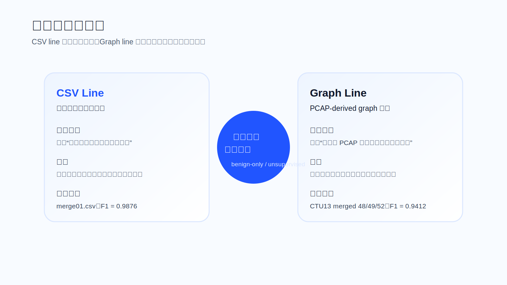

## 4. 整体技术路线与系统构建

### 4.1 三层框架：输入层 / 表示层 / 判别层
从系统设计角度看，本项目采用典型的三层研究框架：

- **Input Layer**：接收结构化流特征表，或接收原始 PCAP 及其下游流记录；
- **Representation Layer**：将输入映射为数值特征向量或流交互图表示；
- **Detection Layer**：输出异常分数、图级分数，并以 benign 参考分布的阈值形成最终判定。

这一框架的意义在于，它把项目从“一个具体脚本”提升为“一个统一的方法学系统”。

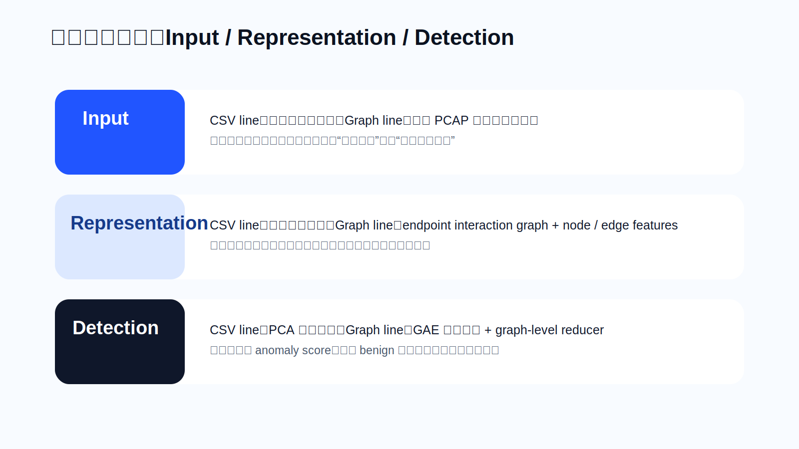

### 4.2 系统整体流程
整个系统的整体流程可以概括为两条并行链路：

1. **CSV 主实验链路**
   - 合并 CSV 数据
   - 标签标准化
   - 数值特征提取与清洗
   - benign-only 建模
   - 重构误差打分
   - 二分类评估

2. **Graph 主实验链路**
   - 原始 PCAP 解析
   - flow 聚合
   - endpoint interaction graph 构建
   - 节点/边特征打包
   - 图自编码器重构
   - graph-level score 聚合与二分类评估

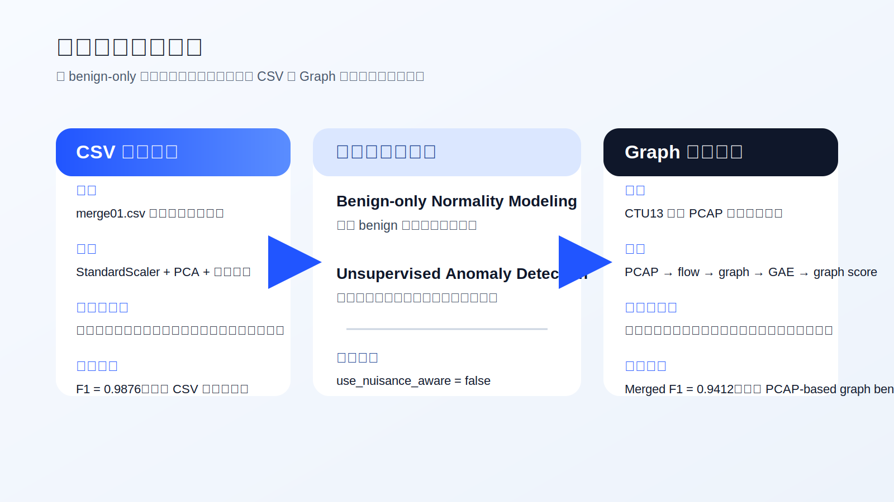

### 4.3 模型建立过程
本项目的模型建立过程不是“直接选一个现成分类器”，而是围绕“如何构造正常行为参考”这一核心思想展开的：

1. 先确定理论核心：benign-only normality modeling；
2. 再根据输入形式分别设计表格表示与图表示；
3. 最后用重构误差、图级聚合等机制形成异常分数。

因此，模型本身只是整个研究系统的一部分，更重要的是输入表示、行为摘要和图级证据组织方式。

### 4.4 数据到判定的完整链路
对于图主线而言，完整链路必须准确写成：

`PCAP -> flow -> endpoint interaction graph -> node/edge features -> GAE -> graph-level score`

这条链路的正式意义在于：

- 它从原始网络数据出发，而不是从预构造表格出发；
- 它能把单个流的局部统计信息提升为交互结构层面的异常证据；
- 它构成了当前项目的 **PCAP-based graph benchmark** 基础。

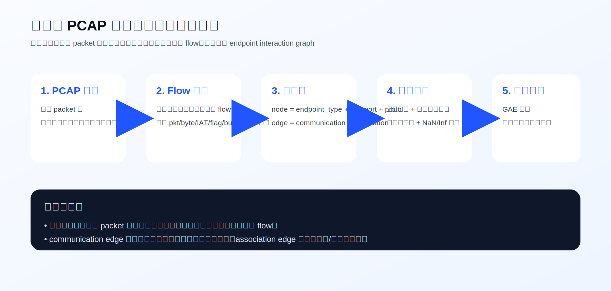

## 5. 方法设计

### 5.1 CSV 主线

#### 5.1.1 方法定位
CSV 主线是一个**轻量无监督表格重构检测器**。它对应的核心实现位于 `src/traffic_graph/pipeline/binary_detection.py`。其理论归类可以写成：

- reconstruction-based anomaly detection
- linear subspace normality modeling

#### 5.1.2 核心流程
CSV 主线的正式流程为：

1. 读取 merged CSV；
2. 保留数值特征列；
3. 用 benign 样本拟合 `StandardScaler`；
4. 用 benign 样本拟合 `PCA`；
5. 对测试样本做重构；
6. 用重构误差作为异常分数；
7. 用 held-out benign 的分位数阈值得到告警判定。

从理论上看，这一路径的含义是：用 benign 数据学习“正常流特征所在的低维子空间”，再把远离这个子空间的样本视为异常样本。

#### 5.1.3 为什么 CSV 主线仍然重要
尽管 CSV 主线不覆盖完整工程链路，但它非常重要，因为它能在最小工程噪声条件下，回答“模型是否本身具备判别能力”。如果 CSV 主线都无法成立，那么图主线的复杂工程实现就难以解释；反之，当 CSV 主线表现稳定时，它就构成项目当前“模型判别能力已被验证”的核心证据。

### 5.2 图主线

#### 5.2.1 核心模型
图主线的核心模型是 **Graph AutoEncoder（GAE）**，对应实现位于 `src/traffic_graph/models/gae.py`。该模型包含：

1. 图编码器（GraphEncoder）；
2. 节点解码器（node decoder）；
3. 边解码器（edge decoder）。

它本质上属于 **benign-only 的图自编码异常检测器**。

#### 5.2.2 核心假设
图主线的核心假设是：

- benign 图更容易被压缩与重构；
- malicious 图因为偏离正常交互模式，会产生更高的重构残差。

因此，GAE 的目标不是直接输出监督分类标签，而是学习“正常交互图的可重构性”，再把重构误差作为异常证据。

#### 5.2.3 为什么使用图自编码器
图自编码器的意义在于，它可以在图结构中同时编码：

- 节点属性；
- 边属性；
- 局部邻接关系；
- 多条边之间的联合结构模式。

这使它比单纯依赖节点统计或简单平均的基线方法，更有机会捕捉“局部交互结构异常”。

### 5.3 从 PCAP 到图的构建逻辑

#### 5.3.1 项目不是直接在 packet 上建图
本项目并不是直接把 packet 当作图节点或图边，而是先把原始 packet 聚合成 flow。这一点非常关键，因为 packet 级别数据过于细碎，噪声高、时序跨度短，不利于直接构造稳定的检测对象。

#### 5.3.2 flow 不是简单五元组
在 `src/traffic_graph/data/pcap_flow_builder.py` 中，flow 被构造成一个带有统计与行为特征的对象，而不仅仅是简单五元组。其信息包括：

- 包数、字节数、时长；
- 正反向包统计；
- 包间隔（IAT）统计；
- 包长分布统计；
- TCP flags 行为；
- ACK delay proxy；
- retry-like proxy；
- prefix behavior signature；
- burst 与小包模式等行为信息。

因此，这里的 flow 更像一个“局部交互行为单元”，而不是单纯的传输记录。

#### 5.3.3 节点不是纯 IP
在 `src/traffic_graph/graph/endpoint_graph.py` 中，节点并非单纯用 IP 表示，而是用：

`endpoint_type + ip + port + protocol`

来共同定义。这样做的意义在于：既保留了端点角色信息（client/server），又保留了端口与协议上下文，从而使节点更接近“网络服务端点”而不是“抽象 IP 标识”。

#### 5.3.4 communication edge 不是简单连边
communication edge 对应 logical flow，但它并不是单纯的“存在连接”标志，而是携带了丰富的统计与行为编码。因此，一条边既表示“谁与谁发生了交互”，也表示“这种交互的行为模式是什么”。

#### 5.3.5 association edges 的作用
除了 communication edge，图中还引入了 association edges，用来表达：

- 同源关系；
- 同目标子网关系；
- 相似 prefix 行为签名；
- 局部结构相似性与行为相似性。

这意味着图并不是纯通信拓扑，而是“通信关系 + 结构/行为相似性”的混合表示。

#### 5.3.6 图的理论意义
图建模的核心意义在于：把“单个样本异常”提升为“局部交互结构异常”。也就是说，恶意行为未必在单个流上特别显著，但可能在若干边之间、某种局部结构中或某个时间窗口内表现出异常组织方式。

### 5.4 图级异常评分思想

图级评分并不是简单对全图节点分数求平均。在 `src/traffic_graph/pipeline/scoring.py` 以及 CTU13 图实验逻辑中，图级检测更强调：

> high-anomaly tail 的局部证据是否足以支撑整个图被视作恶意图。

这意味着：

- 图级分数不是简单平均值；
- 少量关键异常边或局部结构，可能已经足够构成恶意检测证据；
- 项目真正研究的是“图级检测究竟应依赖什么局部证据”。

这也是为什么项目在研究过程中会持续探索 support summary、two-stage、episode-graph 等分支：它们本质上都在追问同一个问题，即图级决策的有效证据应该是什么。虽然这些分支最终没有进入正式主线，但它们反过来证明了当前项目对图级检测证据问题做了系统性探索。

## 6. 研究意义与创新点

### 6.1 理论意义
本项目的理论意义在于：它将恶意流量检测从“纯监督分类”重新定位为“benign-only 异常检测”，并把这种思路同时扩展到表格特征表示与图结构表示。这为处理标签不完备、背景干扰显著、攻击模式开放的问题提供了更合理的理论框架。

### 6.2 方法意义
本项目的方法意义在于：它不仅提出了一条 CSV 主结果线，也提出了一条图侧主 benchmark 线，从而将“模型判别能力验证”和“完整图链路验证”分离开来。这种双证据链结构，能够更清晰地回答“模型有效”与“工程链路可行”这两个常被混在一起的问题。

### 6.3 工程意义
本项目的工程意义在于：它已经真实打通了一条从原始 PCAP 到图级检测的可行链路。即使当前还没有形成完整多数据集 PCAP 实验矩阵，这条链路本身已经证明图建模不是纸面设想，而是可以落地运行、产生稳定 benchmark 结果的系统路径。

### 6.4 应用意义
本项目的应用意义在于：它为未来在真实复杂网络环境下开展恶意流量检测，提供了一种不依赖明文载荷和完备恶意标签的技术思路。尤其是在面对加密流量、未知背景流量和标签不完整场景时，这种 benign-only 的检测范式具有现实潜力。

### 6.5 创新点
从当前正式结果出发，项目可以克制而真实地总结出 4 个创新点：

1. **将 benign-only 异常检测扩展到流交互图表示**
   - 不再局限于表格流特征，而是把 benign-only 异常检测推广到图表示空间。

2. **边特征不是简单流统计，而是行为编码**
   - communication edge 不仅记录连通关系，还编码时间、协议、包长、burst 等行为模式。

3. **图级检测强调局部异常支持，而非全图平均异常**
   - 当前正式图主线更关注高异常尾部的局部证据，这更符合恶意行为在图中的实际表现方式。

4. **采用 CSV 主结果 + CTU13 图主 benchmark 的双证据链完成验证**
   - 同时从能力验证和图链路验证两个角度支撑当前项目的正式结论。

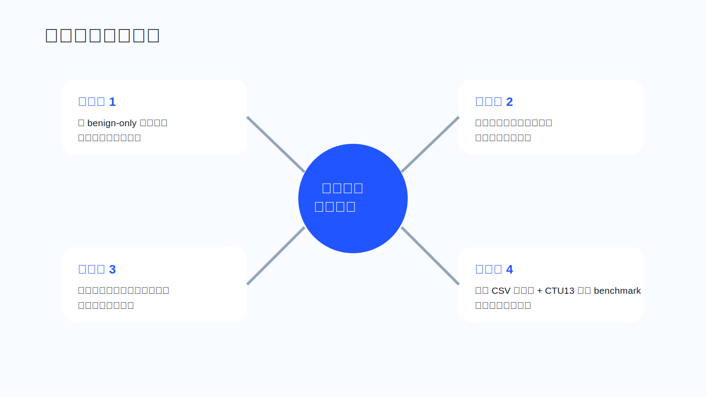

## 7. 关键结果与项目结论支撑

### 7.1 merge01.csv：CSV 主结果
当前正式纳入的 CSV 主结果为 `CICIoT2023 merge01.csv`，其真实汇总指标如下：

- Accuracy: `0.9756 ± 0.0004`
- Precision: `0.9995 ± 0.0000`
- Recall: `0.9759 ± 0.0004`
- F1: `0.9876 ± 0.0002`
- Macro-F1: `0.7064 ± 0.0029`
- Balanced Accuracy: `0.9637 ± 0.0024`
- ROC-AUC: `0.9847 ± 0.0006`
- PR-AUC: `0.9999 ± 0.0000`

这些结果说明：当前模型在标准化流特征输入上具有稳定且较强的分类能力。特别是高 Precision、高 Recall 与高 PR-AUC 的共同出现，说明它既不是依赖极端类别偏置“刷高分”，也不是靠激进阈值获得虚高 recall。

但必须同时明确：这条结果线主要证明的是**模型在标准流特征输入上的分类能力**，并不承担完整 PCAP 链路验证角色。

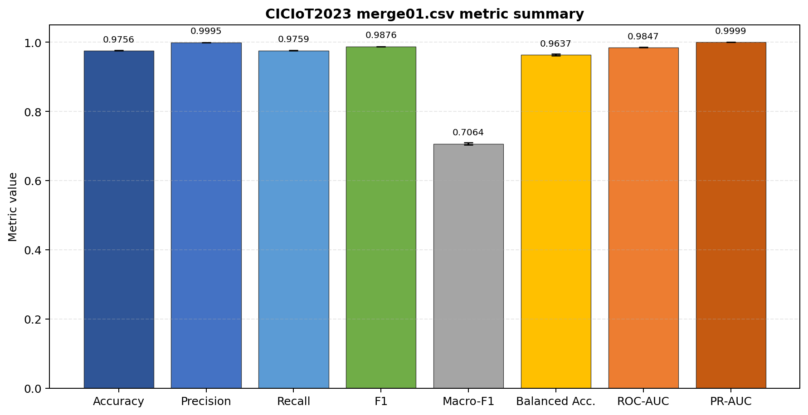

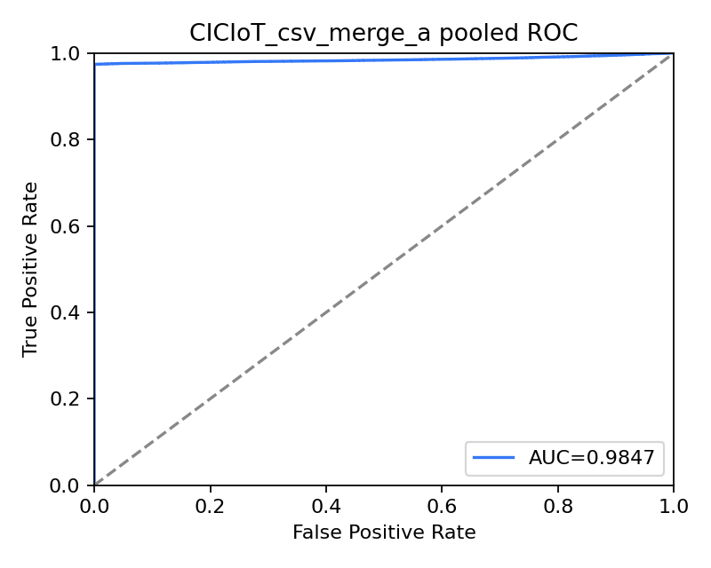

### 7.2 CTU13 48/49/52：图侧主 benchmark
当前正式纳入的图侧主 benchmark 来自 CTU13 `48 / 49 / 52`。Merged `48 / 49 / 52` 的正式图主线结果为：

- edge_v2 F1: `0.9412`
- edge_v2 Recall: `0.9412`
- edge_v2 FPR: `0.0294`
- edge_v2 background hit ratio: `0.2844`

分场景结果为：

- `48`：F1 `0.6667`，Recall `0.5000`
- `49`：F1 `0.8571`，Recall `1.0000`
- `52`：F1 `1.0000`，Recall `1.0000`

这些结果说明：从原始 `PCAP -> flow -> graph -> feature -> detection` 的链路是真实可行的，而且图主线已经能够在复杂背景条件下形成高质量的主 benchmark 结果。

但是同时也必须明确：当前主要剩余问题已不再是“完全抓不到 malicious”，而是 **unknown/background 与 malicious 的重叠仍然较强**。换句话说，CTU13 结果既证明了链路可行，也同步暴露了当前最核心的残余难点。

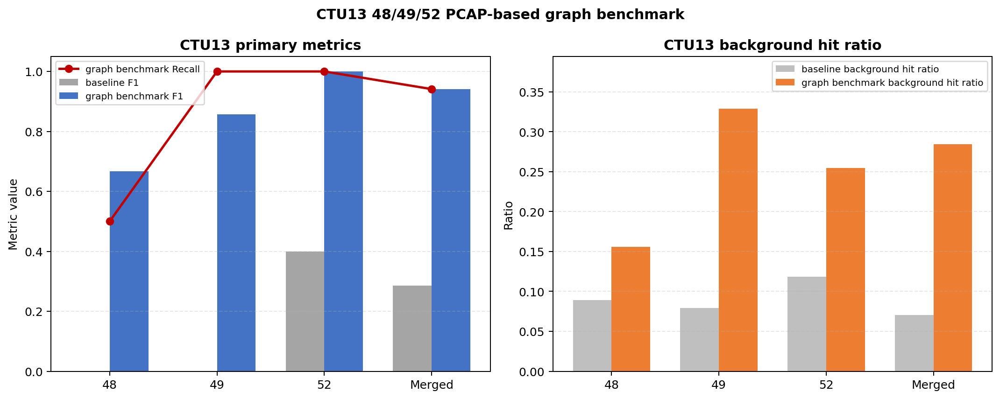
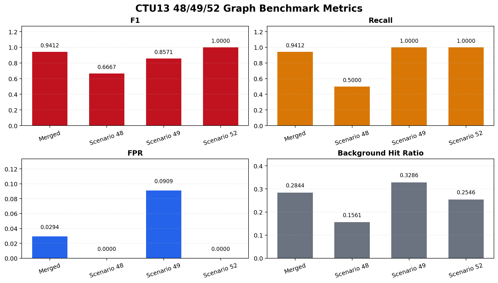
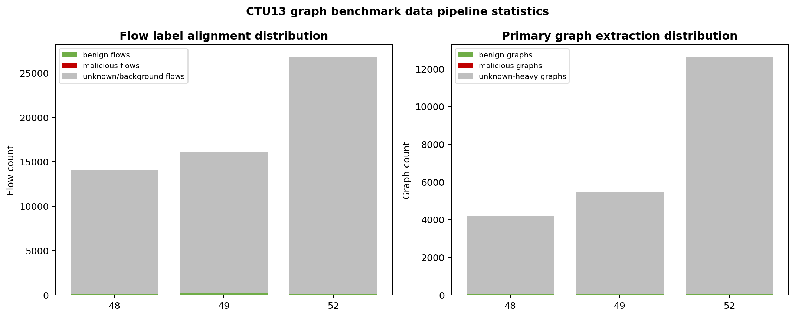

### 7.3 这些结果能支撑什么
基于上述两类正式结果，当前可以稳妥支撑以下结论：

1. `merge01.csv` 足以支撑当前 CSV 主结论；
2. 模型在标准流特征输入上具有稳定且较强的分类能力；
3. CTU13 `48 / 49 / 52` 可以作为图侧主 benchmark；
4. 当前已形成 `PCAP-based graph benchmark` 结果；
5. 当前项目已经同时证明了分类能力与图侧链路可行性；
6. nuisance-aware 关闭并不影响当前最终结论的成立。

### 7.4 这些结果不能支撑什么
基于当前正式结果，不能做以下外推：

1. 不能宣称完整多数据集 PCAP 主实验体系已经完成；
2. 不能宣称已建立跨数据集完整 PCAP 实验矩阵；
3. 不能宣称 `CICIDS2017 PCAP` 已系统验证完成；
4. 不能宣称 background / unknown 问题已经解决；
5. 不能把 nuisance-aware、episode-graph 或 two-stage 写成当前正式主线。

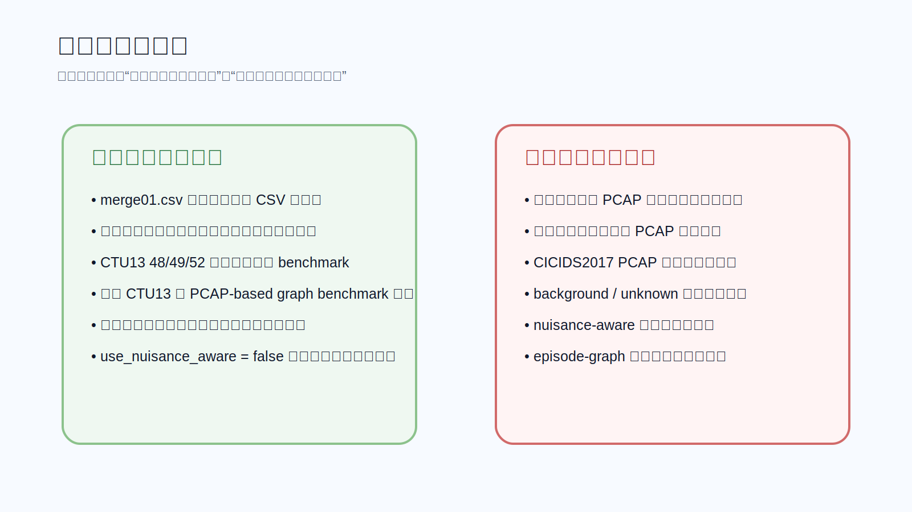

## 8. 研究探索、失败分析与方法边界

### 8.1 nuisance-aware
nuisance-aware 的研究动机是合理的：它直接针对复杂背景流量与 unknown 重叠问题，试图显式引入第三类状态或 rejection boundary。然而当前研究结果表明，尽管 nuisance-aware 揭示了复杂背景流量对检测边界的挑战，但它尚未形成比现有 single-stage 主线更稳定、可直接纳入正式主结果的方案。因此，nuisance-aware 当前更适合作为研究探索方向，而不是最终正式主线。

### 8.2 two-stage micrograph
two-stage micrograph 路线的理论动机在于：先通过 proposal 识别局部可疑区域，再通过 verifier 进行二阶段筛选，以抑制背景误报。然而研究结果表明，失败的根因并不在 verifier 本身，而在于 proposal / extraction 没能稳定提纯 malicious 局部结构，导致 verifier 看到的 micrograph 仍与 unknown 高度重叠。因此，该路线应写成“研究探索与失败分析”，而不能写成正式贡献。

### 8.3 episode-graph
episode-graph 路线的理论动机在于：将检测单位从 endpoint graph 提升为 episode / behavior fragment。然而研究表明，episode proposal / sessionization 没能稳定构造出 malicious episode，导致整条路线退化成 reject-all 或近似 reject-all。由此可见，问题并不主要在 scoring，而在更上游的 stitching / sessionization。因此，episode-graph 适合作为未来工作方向，而不是当前正式主线。

### 8.4 当前正式主线仍然是什么
在经过 nuisance-aware、two-stage、episode-graph 等研究探索之后，当前正式主线仍然是：

- `single-stage edge_temporal_binary_v2`

即：当前正式主线仍是 single-stage 图检测框架，而不是任何二阶段、episode 或 nuisance-aware 扩展版本。

## 9. 局限性与未来工作

### 9.1 当前局限性
本项目当前正式结果只覆盖：

- `merge01.csv`
- `CTU13 48 / 49 / 52`

这意味着结论范围是明确受限的。当前项目可以证明“分类能力已被验证”和“图侧链路可行”，但尚不能证明“跨数据集完整 PCAP 主实验体系已经建立”。

此外，CTU13 图主 benchmark 还显示出一个重要现实问题：在 flow 对齐与 graph extraction 后，unknown/background 仍占明显主导。这说明当前图链路虽然已能有效抓住 malicious，但复杂背景流量重叠仍是主要残余问题。

### 9.2 未来工作
未来最值得继续推进的方向主要包括：

1. 在不替换现有 backbone 的前提下，进一步提高 unknown 与 malicious 的可分性；
2. 继续研究 nuisance-aware，但应聚焦更可分的 nuisance score，而非简单边界调节；
3. 补齐更系统的跨数据集 PCAP 结果，形成更完整的 packet-side 验证矩阵；
4. 对图级检测的局部证据组织方式进行进一步理论化与协议化整理。

## 10. 项目总结

1. 本项目研究的是恶意流量检测，但方法论核心不是传统监督分类，而是 benign-only 的无监督异常检测。
2. 项目采用 CSV line 与 Graph line 两条互补验证线，分别验证分类能力与图链路可行性。
3. CSV 主线基于 StandardScaler + PCA + 重构误差，属于 reconstruction-based anomaly detection。
4. 图主线基于 Graph AutoEncoder，属于 benign-only 的图自编码异常检测器。
5. 图主线并不是直接在 packet 上建图，而是先把 packet 聚合为带行为特征的 flow。
6. endpoint interaction graph 的节点不是纯 IP，边也不是简单连边，而是结构化行为载体。
7. 当前正式图级判定强调高异常尾部的局部证据，而非全图平均异常。
8. `merge01.csv` 足以支撑当前 CSV 主结论，证明模型在标准流特征输入上具有稳定且较强的分类能力。
9. `CTU13 48 / 49 / 52` 可以作为图侧主 benchmark，并应准确写成 PCAP-based graph benchmark。
10. 当前项目已经证明了分类能力与图侧链路可行性，但尚未形成完整的跨数据集 PCAP 主实验矩阵。

